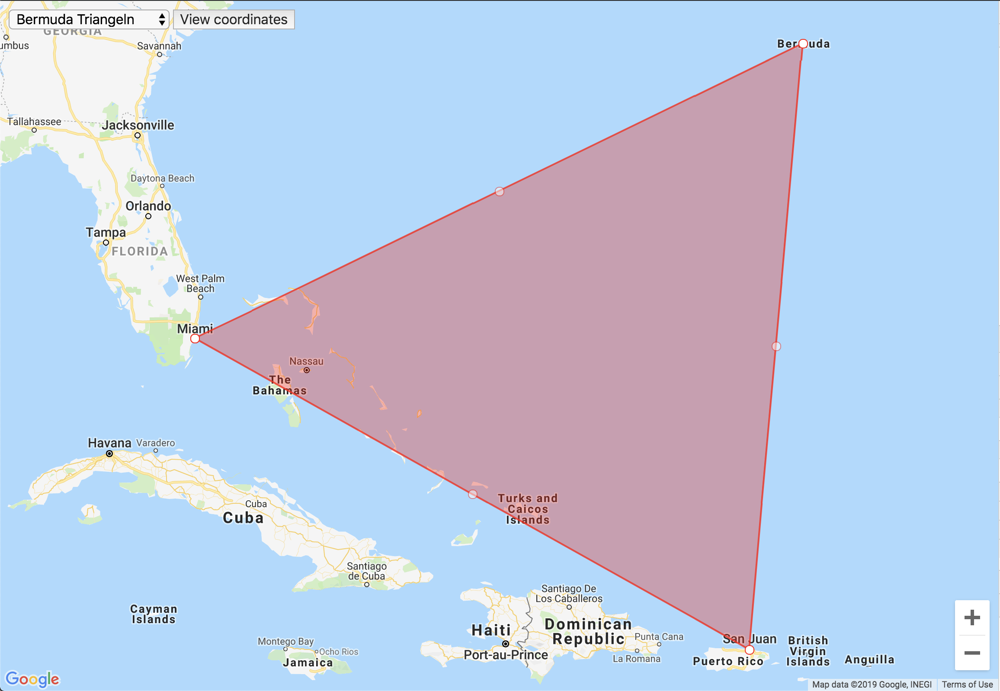
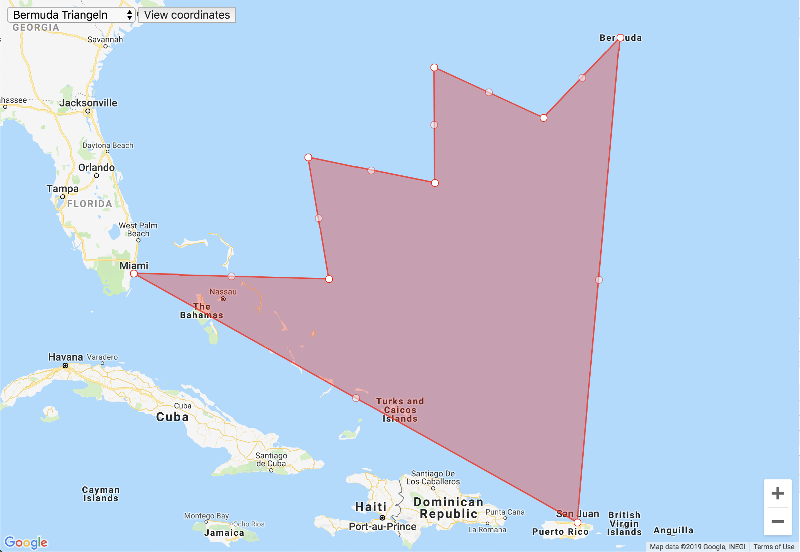
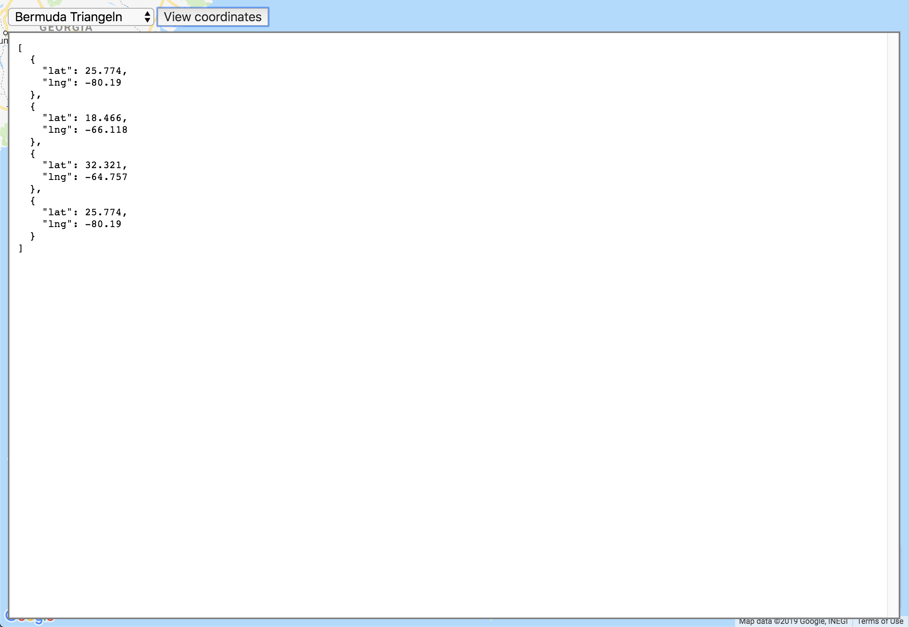

# Google Maps Edit Polygon

Draw and edit polygon in Google Map with the import / export functionality

**View**

**Edit**

**Coordinates**

## How it works

- `input/coordinates.json` contains the coordinates that will be rendered. **It must follow the format specified in the `input/coordinates.json.template` file**
- `.env.json` contains the Google API Key that is required to show the map (Google doesn't allow anymore to use the API without a key)

## Setup

1. Install dev dependencies: 
   `yarn install`

1. Create necessary `.env.json` file: 
   `yarn env` (or `yarn env-win` if you are on windows)

1. Add your Google Maps API Key to `.env.json`: 
   (https://developers.google.com/maps/documentation/javascript/get-api-key)

1. Create sample `coordinates.json` file: 
   `yarn sample` (or `yarn sample-win` if you are on windows) 
    
   or 
    
   Upload the `coordinates.json` file during runtime

1. Browse/view index.html via some http(s) server 
   (e.g. `yarn install http-server && http-server`)
